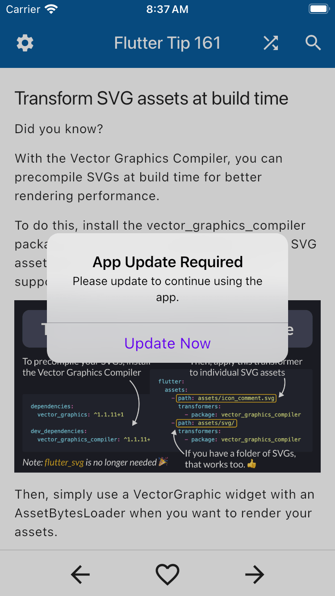
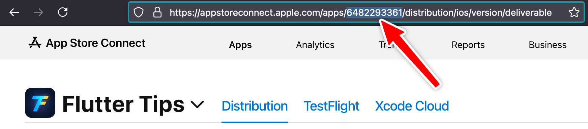

# Force Update Helper

[](https://pub.dev/packages/force_update_helper)
[](https://dart.dev/)
[](http://mit-license.org)
[](http://twitter.com/biz84)

A package for showing a force update prompt that is controlled remotely.

<p align="center">

</p>

## Features

- **Remote control**: control the force update logic remotely with a custom backend, or Firebase Remote Config, or anything that resolves to a `Future<String>`.
- **UI-agnostic**: the package tells you **when** to show the update UI, you decide **how** to show it (localization is up to you).
- **Small and opinionated**: the package is made of only two classes. Use it as is, or fork it to suit your needs.

## Getting started

Depend on it:

```yaml
dependencies:
  force_update_helper:
```

Use it by adding a `ForceUpdateWidget` to your `MaterialApp`'s builder property:

```dart
void main() {
  runApp(const MainApp());
}

final _rootNavigatorKey = GlobalKey<NavigatorState>();

class MainApp extends StatelessWidget {
  const MainApp({super.key});

  @override
  Widget build(BuildContext context) {
    return MaterialApp(
      navigatorKey: _rootNavigatorKey,
      builder: (context, child) {
        return ForceUpdateWidget(
          navigatorKey: _rootNavigatorKey,
          forceUpdateClient: ForceUpdateClient(
            // * Real apps should fetch this from an API endpoint or via
            // * Firebase Remote Config
            fetchRequiredVersion: () => Future.value('2.0.0'),
            // * Example ID from this app: https://fluttertips.dev/
            // * To avoid mistakes, store the ID as an environment variable and
            // * read it with String.fromEnvironment
            iosAppStoreId: '6482293361',
          ),
          allowCancel: false,
          showForceUpdateAlert: (context, allowCancel) => showAlertDialog(
            context: context,
            title: 'App Update Required',
            content: 'Please update to continue using the app.',
            cancelActionText: allowCancel ? 'Later' : null,
            defaultActionText: 'Update Now',
          ),
          showStoreListing: (storeUrl) async {
            if (await canLaunchUrl(storeUrl)) {
              await launchUrl(storeUrl, mode: LaunchMode.platformDefault);
            } else {
              log('Cannot launch URL: $storeUrl');
            }
          },
          onException: (e, st) {
            log(e.toString());
          },
          child: child!,
        );
      },
      home: const Scaffold(
        body: Center(
          child: Text('Hello World!'),
        ),
      ),
    );
  }
}
```

Note that in order to show the update dialog, a root navigator key needs to be added to `MaterialApp` (this is the same technique used by the [upgrader](https://pub.dev/packages/upgrader) package).

## How the package works

Unlike the [upgrader](https://pub.dev/packages/upgrader) package, this package does **not** use the app store APIs to check if a newer version is available.

Instead, it allows you to store the required version **remotely** (using a custom backend or Firebase Remote Config), and compare it with the current version from your `pubspec.yaml`.

Here's how you may use this in production:

- Submit a new version of your app to the stores
- Once it's approved, publish it
- Wait for an hour or so, to account for the time it takes for the new version to be visible on all stores/countries
- Update the `required_version` endpoint in your custom backend or via Firebase Remote Config
- Once users open the app, the force update logic will kick in and force them to update

## Additional details

The package is made of two classes: `ForceUpdateClient` and `ForceUpdateWidget`.

- The `ForceUpdateClient` class fetches the required version and compares it with the [current version](https://pub.dev/documentation/package_info_plus/latest/package_info_plus/PackageInfo/version.html) from [package_info_plus](https://pub.dev/packages/package_info_plus). Versions are compared using the [pub_semver](https://pub.dev/packages/pub_semver) package.
- The `fetchRequiredVersion` callback should fetch the required version from an API endpoint or Firebase Remote Config.
- When creating your iOS app in [App Store Connect](https://appstoreconnect.apple.com/), copy the app ID and use it as the `iosAppStoreId`, otherwise the force upgrade alert will not show. I recommend storing an `APP_STORE_ID` as an environment variable that is set with `--dart-define` or `--dart-define-from-file` and read with `String.fromEnvironment`.
- The Play Store URL is automatically generated from the package name (which is retrieved with the [package_info_plus](https://pub.dev/packages/package_info_plus) package)
- If you want to make the update optional, pass `allowCancel: true` to the `ForceUpdateWidget` and use it to add a cancel button to the alert dialog. This will make the alert dismissable, but the prompt will still show on the next app start.
- You can catch and handle any exceptions with the `onException` handler. Alternatively, omit the `onException` and handle exceptions globally.
- If you use the [url_launcher](https://pub.dev/packages/url_launcher) package to open the app store URLs (which is the recommended way), don't forget to add the necessary query intent inside `AndroidManifest.xml`:

```xml
    <queries>
        <intent>
            <action android:name="android.intent.action.VIEW" />
            <category android:name="android.intent.category.BROWSABLE" />
            <data android:scheme="https"/>
        </intent>
    </queries>
```

### Where to find the iosAppStoreId

Once you have created your app in [App Store Connect](https://appstoreconnect.apple.com/), you can grab the app ID from the browser URL:



Make sure to set the correct `iosAppStoreId` **before** releasing the first version of your app, otherwise users on old version won't be able to update.

### [LICENSE: MIT](LICENSE)